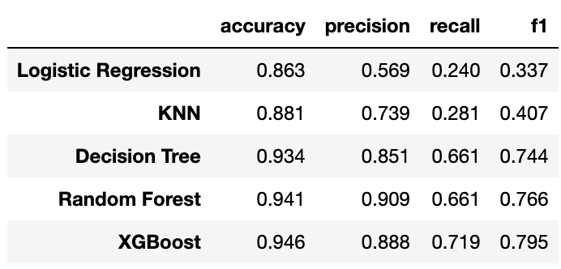
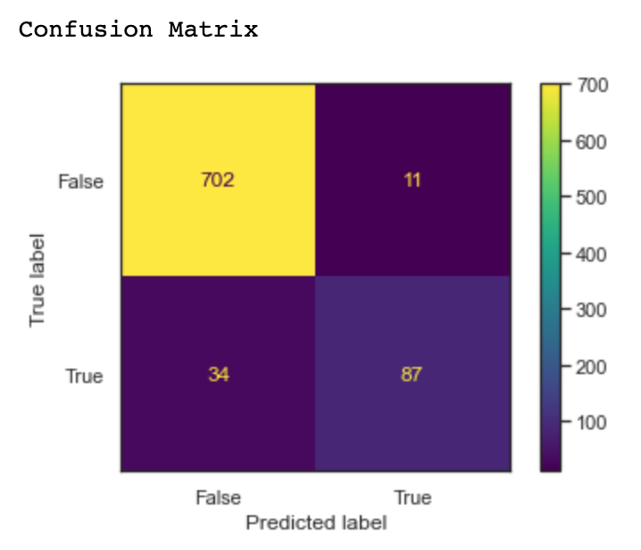

# Predicting Telecommunications Customer Churn

**Authors**: [Rebecca Frost-Brewer](https://www.linkedin.com/in/rebecca-frost-brewer/)


***

According to [Profitwell](https://www.profitwell.com/customer-retention/industry-rates), the average churn rate within the telecommunications industry is 22% (churn rate referring to the rate customers close their accounts or end their business relationship).

# Business Understanding

The telecommunications company, SyriaTel, is faced with the problem of better predicting when its customers will soon churn. They need a solution that will predict whether a customer will ("soon") stop doing business with SyriaTel. This will be valuable to SyriaTel, so that they may better understand their churn rate and identify areas they may address to improve its churn rate.

Finding predictable patterns using a classification model will benefit SyriaTel's business practices to minimize customer churn.

To determine which classification model best predicts potential customer churn, **I will evaluate models' performance using the F1 score**. More on this metric to follow. 

# Data Understanding

The data source for this project comes from [SyriaTel's churn data](https://www.kaggle.com/datasets/becksddf/churn-in-telecoms-dataset). This data is suitable for the project because it includes key performance indicators and data points from SyriaTel related to its customers and their accounts as well as whether the customer churned or not.

The data consists of 3,333 observations with 21 features and no missing values.

**Explanation of Features**

* `state`: the state the user lives in
* `account length`: the number of days the user has this account
* `area code`: the code of the area the user lives in
* `phone number`: the phone number of the user
* `international plan`: true if the user has the international plan, otherwise false
* `voice mail plan`: true if the user has the voice mail plan, otherwise false
* `number vmail messages`: the number of voice mail messages the user has sent
* `total day minutes`: total number of minutes the user has been in calls during the day
* `total day calls`: total number of calls the user has done during the day
* `total day charge`: total amount of money the user was charged by the Telecom company for calls during the day
* `total eve minutes`: total number of minutes the user has been in calls during the evening
* `total eve calls`: total number of calls the user has done during the evening
* `total eve charge`: total amount of money the user was charged by the Telecom company for calls during the evening
* `total night minutes`: total number of minutes the user has been in calls during the night
* `total night calls`: total number of calls the user has done during the night
* `total night charge`: total amount of money the user was charged by the Telecom company for calls during the night
* `total intl minutes`: total number of minutes the user has been in international calls
* `total intl calls`: total number of international calls the user has done
* `total intl charge`: total amount of money the user was charged by the Telecom company for international calls
* `customer service calls`: number of customer service calls the user has done
* `churn`: true if the user terminated the contract, otherwise false


# Modeling
## Baseline Model

I begin the predictive modeling process by creating a baseline model from which to build from. The baseline model in this case is a decision stump (using a Decision Tree classifier) with just one split, i.e., a max depth of 1. This classifier will be a weak learner.

## Vanilla Modeling

In this section, I create vanilla models using a decision tree classifier, logistic regression, k-Nearest Neighbors classifier, random forest classifier, and eXtreme Gradient Boost (XGBoost) classifier.

Each model has its own advantages and disadvantages, which is why I will include each to best determine the strongest predictive model for the stakeholder.

These models' parameters are mostly defaults and not tuned for specificity or improvement. This allows for more opportunity to determine which model(s) will be the best to recommend.

### Decision Tree Classifier

[Decision Trees](https://scikit-learn.org/stable/modules/tree.html) are a non-parametric supervised learning method used for classification and regression with the goal of creating a model that predicts the value of a target variable by learning simple decision rules inferred from the data features; in the case of this project, the decision tree classifier will attempt to predict customer churn.

### Logistic Regression

[Logistic regression](https://scikit-learn.org/stable/modules/linear_model.html#logistic-regression) is a linear model that is used for classification and models the probability of one event or class (out of two alternatives) taking place and that the target variable is categorical, e.g., a customer churns (1) or does not churn (0). Thus, logistic regression is an applicable model to our business problem and may be of value.

### K-Nearest Neighbors Classifier

The [neighbors-based classification](https://scikit-learn.org/stable/modules/neighbors.html#classification) is a type of instance-based learning that computes classification from a simple majority vote of the nearest neighbors of each point: a query point is assigned the data class which has the most representatives within the nearest neighbors of the point. For this modeling, $k$-Nearest Neighbors implements learning based on the  nearest neighbors of each query point, where $k$ is an integer value specified by the user.

### Random Forest Classifier

[Random Forest Classifiers](https://scikit-learn.org/stable/modules/ensemble.html#forest) are a type of ensemble method, which means a diverse set of classifiers is created by introducing randomness in the classifier construction; in this case, he prediction of the ensemble is given as the averaged prediction of the individual decision tree classifiers. In random forests, each tree in the ensemble is built from a sample drawn with replacement (i.e., a bootstrap sample) from the training set.

### XGBoost

From its documentation, [XGBoost](https://xgboost.readthedocs.io/en/latest/index.html) is an optimized distributed gradient boosting library designed to be highly efficient, flexible and portable. It implements machine learning algorithms under the Gradient Boosting framework.

Gradient Boosting alogrithms are a more advanced boosting algorithm that makes use of Gradient Descent. It starts with a weak learner that makes predictions on the dataset. The algorithm then checks this learner's performance, identifying examples that it got right and wrong. The model then calculates the Residuals for each data point, to determine how far off the mark each prediction was. The model then combines these residuals with a Loss Function to calculate the overall loss.

XGBoost, or eXtreme Gradient Boosting, provides a parallel tree boosting that solve many data science problems in a fast and accurate way. It is a stand-alone library that implements popular gradient boosting algorithms in the fastest, most performant way possible. In fact, XGBoost provides best-in-class performance compared to other classification algorithms.

## Tuned Models

Following the first set of vanilla model scores, there is certainly room for improvement in our predictive modeling. While the vanilla RF and XGBoost models had an F1 score of 0.91 on the testing data, it may be possible with further tuning of all five models that we can improve that F1 score.

To best solve our business problem of predicting customer churn, these iterative models will attempt to improve results by utilizing `GridSearchCV` to find the best performing hyperparameters for each model.

In this section, I also include more information on feature importances, classification reports, and confusion matrices.

[**Feature Importances**](https://towardsdatascience.com/understanding-feature-importance-and-how-to-implement-it-in-python-ff0287b20285) refer to techniques that calculate a score for all the input features for a given model; the scores simply represent the "importance" of each feature with a higher score indicating that the specific feature will have a larger effect on the model that is being used to predict a certain variable.

The [**Classification Report**](https://scikit-learn.org/stable/modules/model_evaluation.html#classification-report) is a printed report showing the main classification metrics: precision, recall, and the F1 score, along with the sample size (indicated as 'support').

Remember, precision is the ability of the classifier not to label as positive a sample that is negative (what percent of the predictions were correct?), and recall is the ability of the classifier to find all the positive samples (what percent of the positive cases were caught?). The F1 score can be interpreted as a weighted harmonic mean of the precision and recall that reaches its best value at 1 and its worst score at 0.

The report also includes the macro average (averaging the unweighted mean per label) and weighted average (averaging the support-weighted mean per label).

The classification report is meaningful to this business problem because the model eventually chosen to predict customer churn should correctly determine a given class.

The [**Confusion Matrix**](https://scikit-learn.org/stable/modules/model_evaluation.html#confusion-matrix) is a function evaluates classification accuracy by computing the confusion matrix with each row corresponding to the true class. Since our data is imbalanced, the included confusion matrices will be normalized such that it will show the percentage prediction of each class made by the model for that specific true label.

The higher the diagonal values of the confusion matrix the better, indicating many correct predictions of True Positives and True Negatives.

***

For each of the tuned models, I create a parameters grid that is passed into `GridSearchCV` with scoring set as `F1_weighted` due to the imbalanced dataset in order to determine the best performing parameters for each classifier. Here is the final results table of the tuned models:



The final model selected to address the business problem of predicting customer churn is the tuned XGBoost classifier. Remember, the XGBoost classifier provides parallel tree boosting that can solve many data science problems in a fast and accurate way.

**Final Model Metrics**

* Training F1-Score: 0.98
* Validation F1-Score: 0.94
* F1-Score Delta: 0.045

TTesting Classification Report
              precision    recall  f1-score   support

       False       0.95      0.98      0.97       713
        True       0.88      0.69      0.78       121

    accuracy                           0.94       834
   macro avg       0.92      0.84      0.87       834
weighted avg       0.94      0.94      0.94       834



# Final Model Evaluation

With this iterative model of the XGBoost classifier, the F1-score on the training data is 0.98 and the F1-score on the test data is 0.94. With a delta of 0.05, this model does not seem to be  overfitting the data. Its F1-score is higher (0.94) than the baseline decision stump model (0.81).

Looking at the confusion matrix, the XGBoost model is correctly predicting 98% of True Negatives and 69% of True Positives. Its Type 1 Error (False Positives) are being predicted 31% of the time. The True Positive prediction percentage (69%) is marginally lower than the tuned random forest model and its percentage of Type 1 errors (31%) is marginally higher than the tuned random forest model as well.

Further analysis indicated that the most important features influencing the model are:

1. **the number of calls the customer made to customer service**
2. whether the customer has a voice mail plan
3. the total number of minutes used per day
4. **whether the customer has an international plan**
5. the total number of international calls made

Both of the bolded features were also influential in other models evaluated, thus I recommend conducting further customer analysis to identify trends regarding calls to customer service – issues, volume, customer service rating. Additionally, based on exploratory analysis, customers with an international plan are more likely to churn than those without an international plan – what about the international plan may be influencing churn?

# Conclusion and Recommendation

The final model selected to address the business problem of predicting customer churn is the tuned XGBoost classifier. Remember, the XGBoost classifier provides parallel tree boosting that can solve many data science problems in a fast and accurate way.

The F1-score is the best metric to measure the performance of the predictive modeling for this business case because it is the harmonic mean of precision and recall, two measures important to predicting a binary class (churn or no churn), averaged to best evaluate imbalanced data.

The F1-score of this final model (the tuned XGBoost model) is 0.94 whereas the baseline model's F1-score is 0.81. Further, this final model correctly predicts True Negatives 98% of the time and True Positives 69% of the time.

A couple limitations of XGBoost that must be noted: XGBoost is more likely to overfit than bagging does (i.e. random forest) and it does not perform as well on sparse and unstructured data. However, in this business case, our data is robust with few outliers (based on exploratory analysis) and a selection of hyperparameters that perform the best.

Lastly, this final model does predict Type 1 errors (False Positives) 31% of the time, so that must be considered in predicting customer churn on future, unseen data.

# Future Work

* Provide a larger dataset: The predictive modeling for SyriaTel can be improved upon for more enhanced performance with a larger dataset from which the models can be trained. Further, the dataset should include dates/time periods to understand when the data had been collected.
* Further Analysis of Feature Importances:  Whether SyriaTel's customers have a voice mail plan or an international plan as well as the number of international calls made or number of calls made to customer service all had more influence on the churn rate than other features.
* Evaluate Customer Service: Conduct customer service surveys for more information on why customers are calling
* Conduct industry benchmarking to determine how SyriaTel's voice mail and international plans compare to its offerings

# For More Information

Please review our full analysis in [our Jupyter Notebook](./index.ipynb) or our [presentation](./ppt-churn-presentation.pdf).

For any additional questions, please contact **Rebecca Frost-Brewer (frostbrewerr@gmail.com)**

# Repository Structure

```
├── README.md                         <- The top-level README for reviewers of this project
├── index.ipynb                       <- Narrative documentation of analysis in Jupyter notebook
├── img
    ├── churn.png
    ├── final-matrix.png
    ├── intl-plan.png
    ├── num-cust-calls.png
    ├── vm-plan.png
    └── rfb-headshot.png
├── jnb-telecom-customer-churn.pdf    <- PDF of jupyter notebook
├── ppt-churn-presentation.pdf        <- PDF version of project presentation
├── readme-telecom-customer-churn.pdf <- PDF of github readme
├── rfb-headshot.png
└── telecom.csv                       <- Sourced externally
```


